# Отчёт по лабораторной работе №1: базовая настройка PostgreSQL на Debian

**Цель:** настроить окружение, установить PostgreSQL в Debian, освоить базовые приёмы администрирования системы и СУБД.

---

## 1. Подготовка среды

```bash
sudo apt update -  обновляет информацию о доступных пакетах из репозиториев
sudo apt upgrade устанавливает новые версии уже установленных пакетов
```

---

## 2. Установка PostgreSQL

Установка PostgreSQL и доп. пакета:

```bash
sudo apt-get install postgresql postgresql-contrib -y

```

postgresql - основной пакет СУБД

postgresql-contrib - дополнительные модули и утилиты

-y - автоматическое подтверждение установки
Проверка версии:

```bash
maks@maks:~$ psql --version
psql (PostgreSQL) 15.15 (Debian 15.15-0+deb12u1)
```

---

## 3. Создание служебной учётной записи `postgres`

Проверка существования пользователя в системе

```bash
id postgres
```

Переход под пользователя `postgres`:

```bash
sudo -i -u postgres
```

---

## 4. Поиск и изучение конфигурационных файлов

```
Редактируем файлы
sudo nano /etc/postgresql/15/main/postgresql.conf:
sudo nano /etc/postgresql/15/main/pg_hba.conf
```

Замена в файлах: Порт с 5432 на 5433

"\*" - для подключений из локальной сети

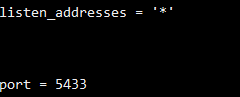

Cмена методов аутентификации

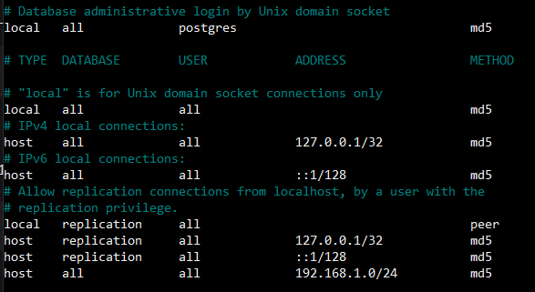

## 5. Изменения конфигурации PostgreSQL (подробно)

Проверка статсука сервера
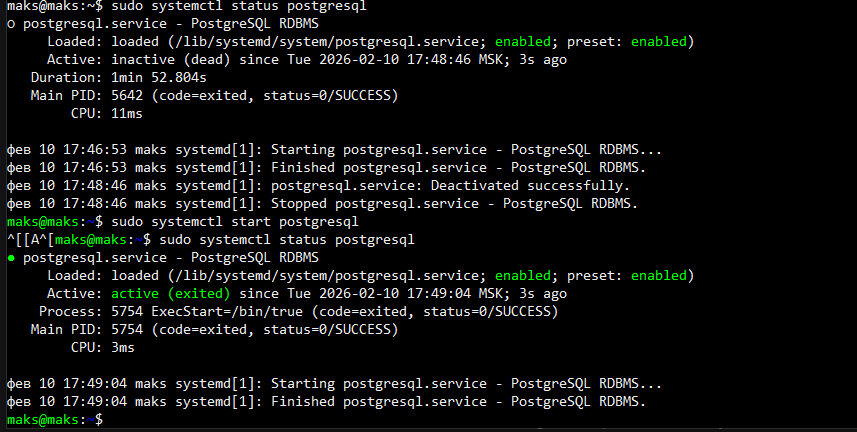

`sudo systemctl enable postgresql` - велючение автозапуска

## 6. Создание тестовой базы данных

Создание пользвоателя
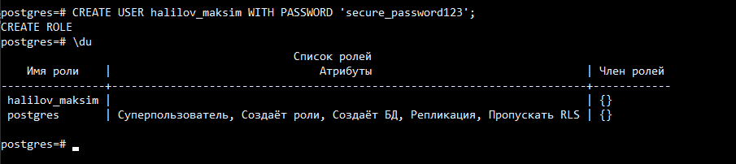
Список баз данных
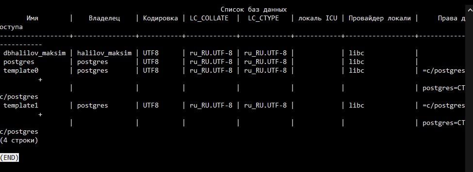

## 7. Знакомство со схемами

- База данных - контейнер, содержащий схемы, таблицы и другие объекты

- Схема - пространство имён внутри базы данных для организации объектов

### Cоздание схемы

```sql
SHOW search_path;
```

Вывод:

```
"$user", public
```

Изменение search_path в текущей сессии:

```sql
SET search_path TO test_schema, public;
SHOW search_path;
```

Вывод:

```
test_schema, public
```

Создание схемы - `CREATE SCHEMA test_schema;`

## Настройка прав

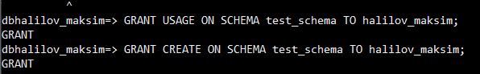

## 8. Использование утилиты psql для базовых операций

`CREATE TABLE public.students (id SERIAL PRIMARY KEY, name TEXT, age INT );`

Вставка даннных через INSERT

---

Внесение данных


Изменение в таблицах

---

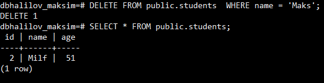

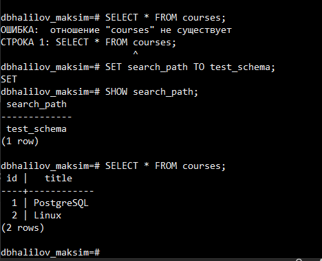

## 9. Настройка локальных и сетевых подключений

```
'localhost' - слушает только локальные подключения
'*' - слушает все сетевые интерфейсы
```

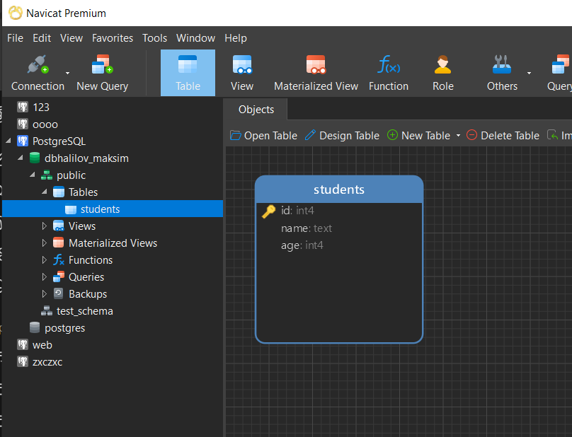

## 10.Журналирование (logging)

- Изменить настройки журналирования
  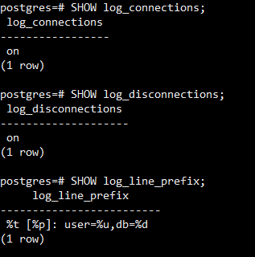
- вывод логов

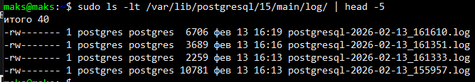

## 11.Назначение ролей и прав

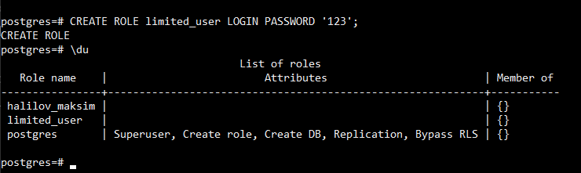

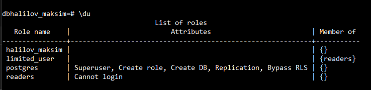
