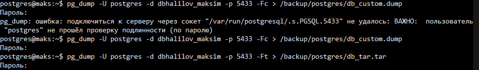
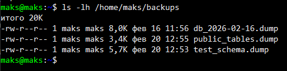
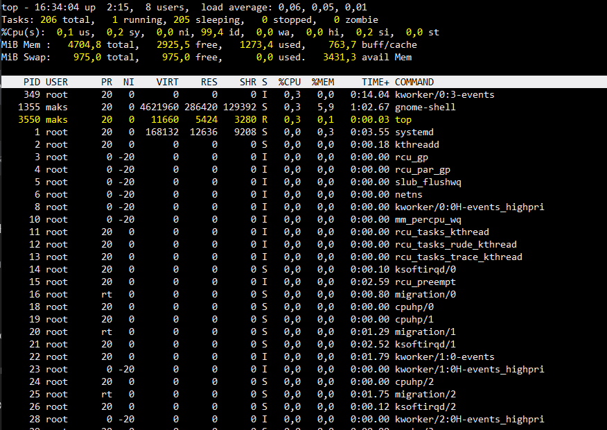
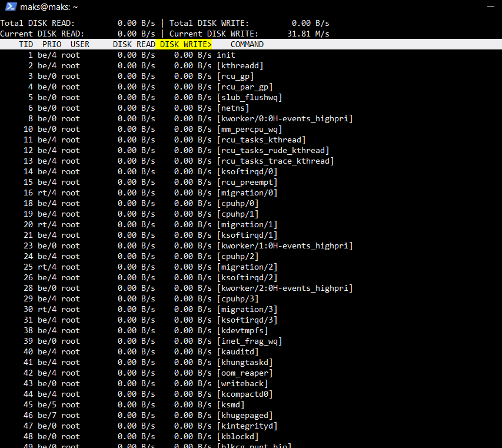
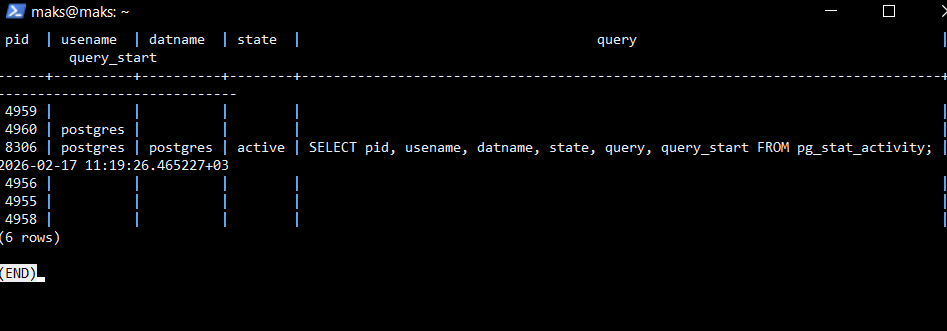
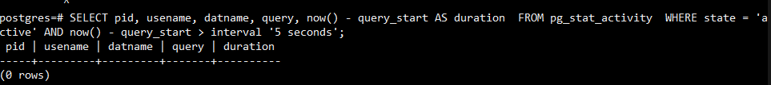
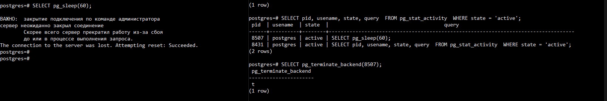
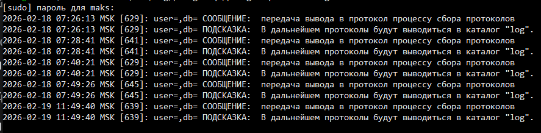
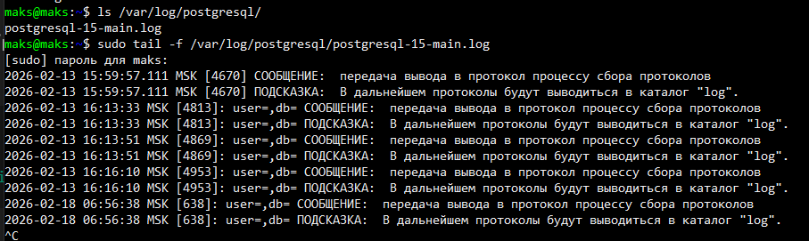

# Лабораторная работа №2: резервное копирование, восстановление и мониторинг в Debian и PostgreSQL

**Цель:** Изучить способы резервного копирования баз данных PostgreSQL и восстановления
их в среде Debian. Освоить базовые инструменты мониторинга системы и сервиса
PostgreSQL.

---

## 1. Утилиты резервного копирования

- pg_dump(тип копии) — логическое резервное копирование базы данных.
- pg_basebackup — физическое резервное копирование всего кластера PostgreSQL.

---

## 2. Создание резервной копии

- обычный sql
- Fc - меньше размер \ можно восстанавливать выборочно

- Ft - архив

## 3. Частичное (выборочное) резервное копирование

`pg_dump -U postgres -p 5433 -t public.students -Fc dbhalilov_maksim -f /home/maks/backups/public_tables.dump`

`pg_dump -U postgres -p 5433 -n test_schema -Fc dbhalilov_maksim -f /home/maks/backups/test_schema.dump`

---

## 4. Восстановление из резервной копии

## 5. Автоматизация бэкапов с помощью cron

- Ротация удаление стрых файлов чтобы не было накоптельного эффекта
  `find /home/maks/backups -type f -mtime +7 -delete`

## 6. Мониторинг состояния системы

- установка пакетов

  

- top болеее удобная версия
  
- iotop
  

## 7. Мониторинг PostgreSQL

- Смотрим все активные подключения и запросы

- Ищем запросы, выполняющиеся дольше 5 минут

- результат

## 8. Логирование и анализ логов

- Системные логи Debian - Запуск/остановка сервисов, ошибки ОС, проблемы с дисками

- Логи PostgreSql - Подключения, запросы, ошибки SQL

- создание ошибочного лога

