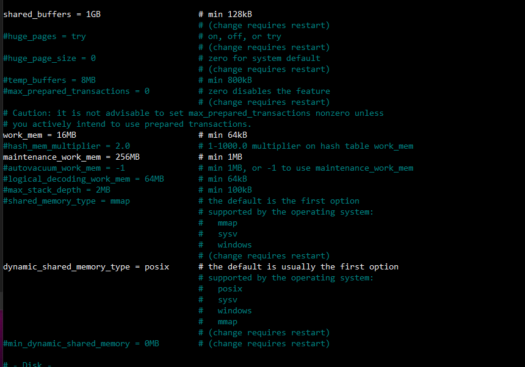
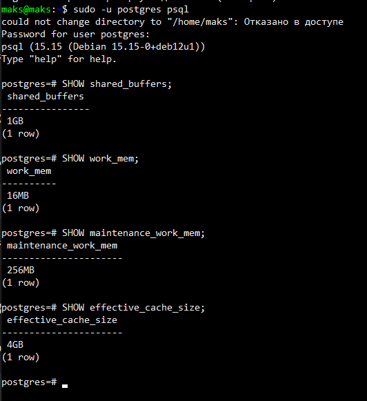
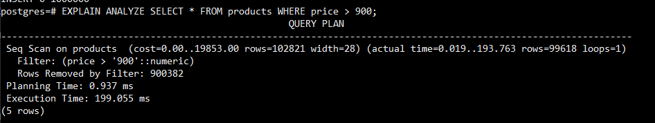
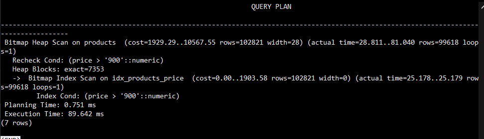
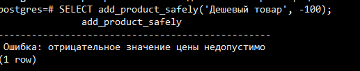
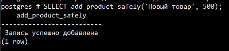
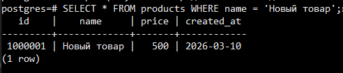
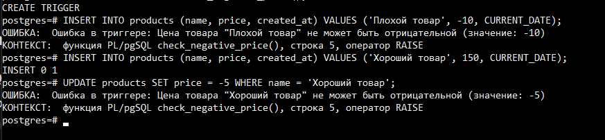
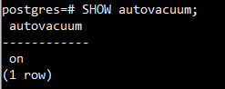
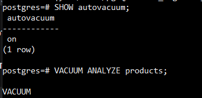

## Лабораторная работа №3: Расширенные возможности и оптимизация PostgreSQL на Debian
Цель:Получить опыт в использовании продвинутых функций PostgreSQL (индексы, 
планы запросов, функции и триггеры, базовые приёмы оптимизации).
---

## 1. Оптимизация конфигурации PostgreSQL

- shared_buffers : Определяет объем оперативной памяти, выделяемой для кэширования данных PostgreSQL.
- work_mem : Задает объем памяти для операций сортировки и хеширования, выполняемых в рамках одного запроса для каждой сессии. 
- maintenance_work_mem : Лимит памяти для задач обслуживания, таких как VACUUM, ANALYZE, CREATE INDEX. Увеличение этого параметра ускоряет сборку мусора и создание индексов
- effective_cache_size : Оценка общего размера файлового кэша операционной системы. PostgreSQL использует это значение для оценки вероятности нахождения данных в кэше


---

## 2. Создание и анализ индексов
```py
CREATE TABLE products (
    id SERIAL PRIMARY KEY,
    name VARCHAR(100),
    created_at DATE
)
```
- Выполнение поиска дорогих товаро

```EXPLAIN ANALYZE SELECT * FROM products WHERE price > 900;```

- Создайте индекс для ускорения этого запроса.



`CREATE INDEX idx_products_price ON products(price);`



## 3. Хранимые функции
- проверка отрицательных значений



- добавление товара 



- проверка товара



---

## 4. Триггеры



## 5. Автоматическая очистка и статистика (VACUUM, ANALYZE)




